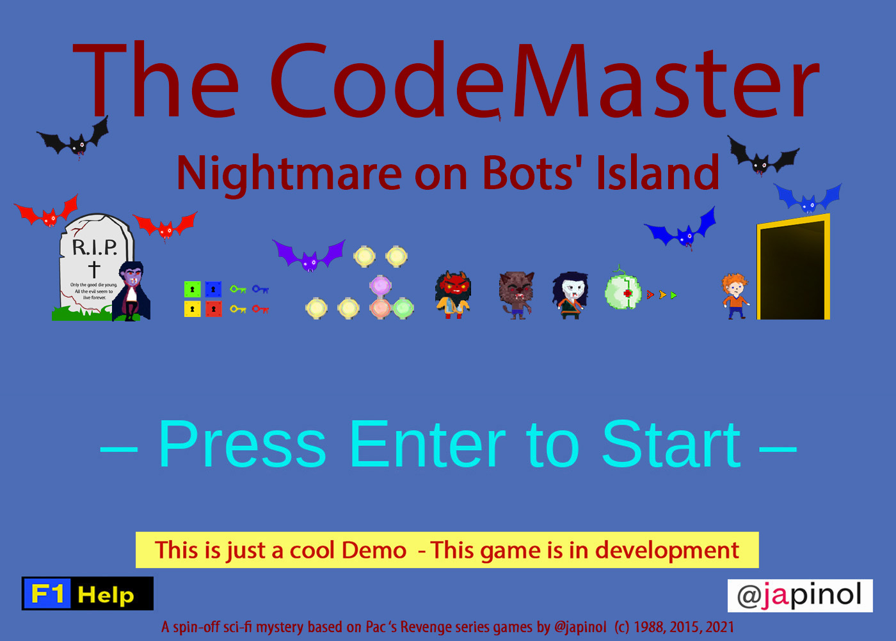
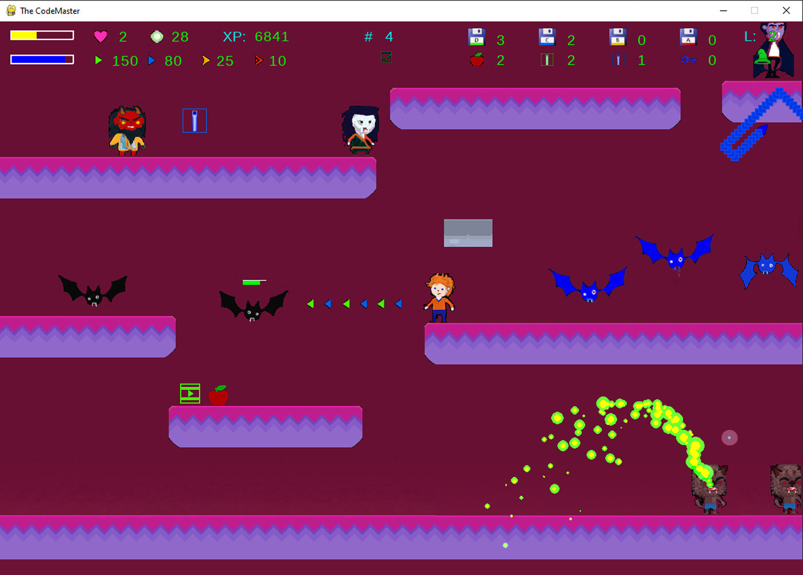
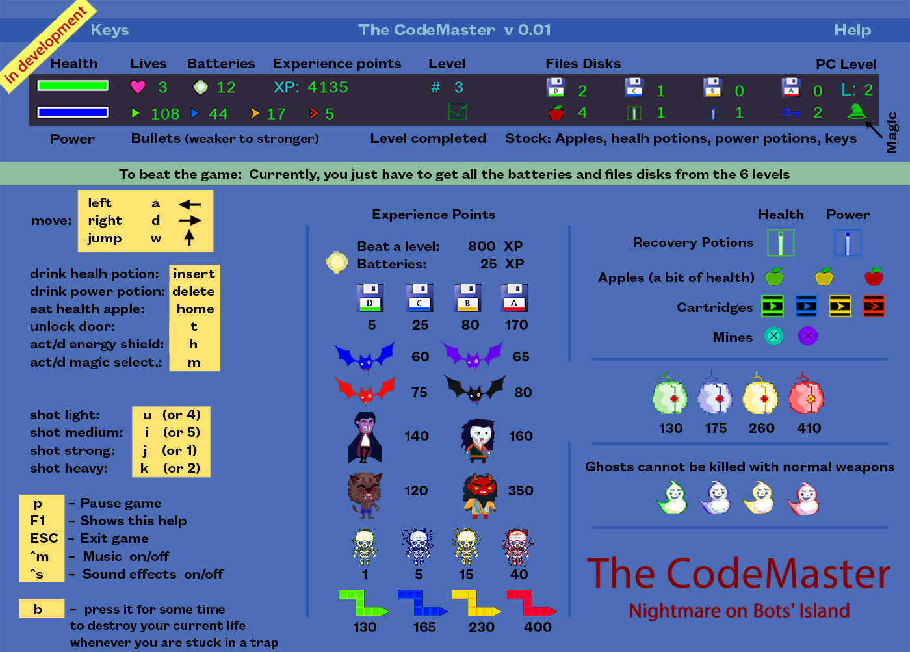

## The CodeMaster. Nightmare on Bots' Island

	The CodeMaster is a spin-off sci-fi mystery based on 1988 RPG platformer game Pac's Revenge.
	program: The CodeMaster. Nightmare on Bots' Island.
    name as a package: codemaster 
	version: 0.0.2
	language: English
	author: Joan A. Pinol
	author_nickname: japinol
	author_gitHub: japinol7
	author_twitter: @japinol
	main module: codemaster.py
	description: A spin-off sci-fi mystery based on Pac's Revenge series games by @japinol  (c) 1988, 2015, 2021.
	requirements: pygame
	Python requires: 3.8 or greater.
	Python versions tested: 
        > 3.10.10 64bits under Windows 11
        > 3.9.12 64bits under Windows 11
        > 3.8.5  64bits under Windows 10
        > 3.8.5  under Ubuntu 20.04
        > 3.9.12 under Ubuntu 20.04

## Screenshots

  
  
  

## History of the series. A spin-off? What do you mean?
	> Yes, this is a spin-off of an old game from the same author [myself.  ; ) ]
	> Original Pac's Revenge (1987-88); ahead of its time story:
	    > In a world where the human race has expanded for several planets of the nearby galaxies, 
          there is an environmental menace about to explode.
          This menace would have catastrophic consequences for the settlements in the Systems of 
          Draco II, Hydrus I, and the very Milky Way.
          When the United Federation of Planets (UFEP) detected the worst environmental probe results 
          in several years, they were not taken by surprise.
          They thought they knew who was behind all this, but they could not prove it just then.
          Present time:
          Some weeks ago, all communications from the Negasus System were stopped. 
          So, the UFEP cannot be sure if its government and leader is still the same, that is, Tetsuo Yagami.
          Given the seriousness of this crisis, the UFEP send their best scientific secret agent 
          to find out what is going on in the Negasus System, to collect evidence of 
          transgressions of the UFEP laws, and to minimize the environmental crisis if possible 
          by reducing the radiation waste.
        > Pac's Revenge had two parts, that I called phases:
			> Part 1:
              Pac travels with his spaceship to the Negasus System.
              Soon he discovers that entering the Negasus System will not be easy,
              because of the barriers and traps surrounding it.
              But finally, he beats the Negasus exo-defences and arrives at Orus, 
              the most industrialized planet of the Negasus System where its government lies.
			> Part 2:
              Pac lands his spaceship on the outskirts of the planet.
              He takes his anti-radiation briefcase and enters what clearly is a very industrialized land.
              The platformer part of Pac's Revenge game started this way.
              Pac with his special briefcase starts to collect all the radioactive 
              batteries that he can find while bypassing the security defenses and traps.
              In the platformer part of the original game, our protagonist did not have any
              weapon, he just could dodge the industrial machines and robots that he encounters.
              A lot of industrial robots make this difficult, but finally, Pac arrives 
              at the government offices.
              There, he discovers that the country's government has been transformed into a 
              dictatorship at the hands of a tyrant who calls himself Great Emperor Tetsuo.
              Tetsuo's motivation seems to be acquiring power and money to attract cute young women.
              The fact that she receives him sitting on a throne that is actually a toilet makes 
              Pac suspect that he has to deal with a madman.
              Someway, Pac has to come back to de UFEP headquarters with the batteries he has recovered, 
              and prove what is happening in the Negasus Imperial Planet.
              Finally, Pac beats Tetsuo escaping from Negasus and completing his mission.
        > What made Pac's Revenge an interesting game was dealing with philosophical
          and political issues in a futuristic world: environmental contamination, 
          techno-ultra-liberal government despotism, and sexual exploitation. 
          Well, in fact, there was no other character in the game, so it had no woman on it.
    > The CodeMaster. Nightmare on Bots' Island ...
        > Takes place some years later. 
        > Pac is considered a hero at the headquarters of the UFEP.
        > Pac now has a girlfriend, Kaede, to who he wants to propose (he met her in Pac's Revenge 2).
        > For this reason he travels to the planet where Kaede's father, Kaito, 
          has his kingdom, but something there is wrong.
        > Questions you will not get an answer from this demo:
			> Will Pac get Kaede's hand from her father?
			> What is really happening in Kaito's kingdom? 
			> Who is the CodeMaster and what he has to do with all this?

## Rules and user guide

	> Demo version:
	    > This is an early demo version of the game.
           In fact, currently, this is the only version.
	    > This demo does not have a story to accompany the action of the game.
	> We live in an open world:
        > 'The Codemaster' is an open-world RPG platformer game. 
          You can move around all levels whenever it makes sense to the story.
	> To beat the game:
	    > In this demo, you just have to get all the batteries and files disks from the 6 levels.
	> Levels: 
	    > In this demo, levels are completed by getting all the batteries and files disks.
	> Doors: 
	    > Use them to go to other levels.
        > To unlock a locked door you need to use the right door key.
	> Colors: 
	    > Some objects and NPCs in the game represent their difficulty, utility, power, 
          or effectiveness by using colors.
          These are such colors ordered from lower to higher:
			> Green:  Low level items or NPCs.
			> Blue:  Medium level items or NPCs.
			> Yellow:  Better than medium level items or NPCs.
			> Red:  High level items or NPCs.
	> Player movement: 
	    > You just can move left, right or jump.
	> Player level up: 
	    > You can level up by gaining experience points.
	    > When you level up you improve your skills:
            > Currently, you just get skills when you level up to level 2.
              That is what you get:
                > Energy Shield A
                > Vortex of Doom B spell, in slot 1.
                > Vortex of Doom A spell, in slot 2.
                > Lightning Bolt A spell, in slot 3.
                > Doom Bolt B spell, in slot 4.
                > Doom Bolt A spell, in slot 5.
            > In the future, your stats will be level-up-friendly and we will add more skills.
	> Player actions:
	    > Eat an apple from your stock.
	    > Drink a health potion from your stock.
	    > Drink a power potion from your stock.
	    > Get items automatically just by colliding with them.
        > Enter in unlocked doors just by approaching them.
        > Use the right keys on locked doors to unlock them.
        > Activate/deactivate an energy shield. 
          Only if the player has reach a certain level.
        > Activate/deactivate magic NPC selector (pressing m).
        > Choose current magic attack  (pressing 1, 2, 3, 4, 5, etc)
            > Choose 0 to have no spell ready.
        > Cast spells that target an NPC:
            > Vortex of Doom. 
            > Lighning Bolts.
            > Doom Bolts.
        > Kill its current life by pressing the <b> key for a time.
	> Player's ways of dying:
	    > A player dies if all his lives are killed.
	    > A life is killed:
            > When its heatlh is lower than 0.
            > When the player falls into a hole reaching the lower screen boundary.
            > When the player is stuck in some trap and press the <b> key for a time.
	> Information in the score line:
		> First line:
			> ====:  Health bar.
			> Heart:  Remaining lives.
			> Batteries: # of Batteries you have recovered.
			> XP: 	  Experience points. They also represent your score.
			> #: Current level.
			> Files Disks D, C, B, A: # files disks of each type that you have recovered.
			> L: Player level  (level up by collecting XP).
		> Second line:
			> ====:  Power bar.
			> Remaining bullets for each of the four weapons.
			> Under #: A check symbol appears if you have beaten the current level.
			> Apples: Stock of apples in your inventory.
			> Health potions: Stock of health potions in your inventory.
			> Power potions: Stock of power potions in your inventory.
			> Door keys: Stock of door keys in your inventory.
			> A green hat indicates that the magic mode is on.
              		  You can select a target when you level up to level 2.
	> Batteries: 
	    > They represent radioactive waste due to cheap nuclear industrialization an weaponry.
          Radioactive batteries are the main thing that connects this game to the original Pac's Revenge game.
	> Potions: 
	    > Recovery potion: health.
	    > Recovery potion: power.
	> Cartridges: 
	    > They contain bullets. There is one cartridge type for each kind of bullet.
	> Magic: 
        > To be able to use it, you need a skill that will be activated
          when you level up to level 2.
	    > You can activate a magic selector to use magic on an NPC.
	    > Magic spells:
    	    1. Vortex of Doom B: A Vortex of Doom that targets the selected NPC.
    	    2. Vortex of Doom A: A more powerful Vortex of Doom spell.
    	    3. Lightning Bolt A: A lightning bolt that targets the selected NPC.
    	    4. Doom Bolt B: A doom bolt that targets the selected NPC.
    	    5. Doom Bolt A: A more powerful Doom Bolt spell.
	    > There are limits of spells casted than depend on the type of spell:
    	    > You can have only N active spells of one kind on a target.
    	    > You can have only N active spells of one base kind on a level.
	> Apples: 
	    > Eat them to recover a bit of health.
          There are three types of apples:
    	    > Green apples: They are less than normal quality apples but still tasty.
	        > Yellow apples: They are normal quality apples.
	        > Red apples: They are high-quality apples.
	> Weapons and bullets:
        > There are four kinds of weapons that you can use.
          Each one of these weapons has a different range, power, and power use:
            > A light weapon: Laser 1. 
                > Great range but very low power.
                > It consumes just a bit of your power attribute.
                > Very easy to find.
            > A medium weapon: Laser 2.
                > Good range but low power.
                > It consumes a little of your power attribute.
                > Easy to find.
            > A strong weapon: Photonic.
                > Low range but good power. 
                > It consumes a good deal of your power attribute.
                > Difficult to find.
            > A heavy weapon: Neutronic.
                > Pretty good range and very high power. 
                > It consumes a lot of your power attribute.
                > Very difficult to find.
	> Energy shields:
        > Right now there is only one kind of them.
            > A neutronic energy shield o type A:
                > To be able to use it, you need a skill that will be activated
                  when you level up to level 2.
                > It blocks all the bullets headed in its direction.
                > Snakes change their direction when they hit one.
                > It consumes a little bit of your power while is on.
                > When destroyed, it costs you some power. Then, it is created again.
                > Its color changes from light blue to yellow and dark pink depending on his health stat.
	> Files disks: 
	    > There are four types of files disks:
	        > Type D: They contain low interesting data.
	        > Type C: They contain medium interesting data.
	        > Type B: They contain good interesting data.
	        > Type A: They contain high interesting data.
        > In later versions of the game:
            > You will use them on the computers.
	> Computers: 
	    > Right now, they are just decoration.
          In later versions, they will have an important role in beating the game.
	> Mines: 
	    > There are two types of mines:
	        > Aqua mines: They deal a good deal of damage.
	        > Lilac mines: They deal great damage
	> Clocks: 
	    > Currently, clock timers do not have a real effect in the game.
          In the future, they will trigger some cool stuff.
	> Bats:
	    > They bite your head/neck whenever you are too close to them.
	    > There are four types of bats:
	        > Blue bats: They deal basic damage.
	        > Lilac bats: They deal medium damage
	        > Red bats: They deal a good deal of damage.
	        > Black bats: They deal great damage.
	> Ghosts:
	    > Cannot be killed/hit with normal weapons.
          Only Dark magic spells can damage them, i.e, Vortex of Doom and Doom Bolts.
	> Snakes:
	    > They bite you whenever you are too close to them.
	    > Their body also gives you damage but much less than their head.
        > You can hit only their head. So do not waste bullets on their body.
	> Other NPCs:
	    > Skulls.
	    > Wolf-men.
	    > Male vampires.
	    > Female vampires.
	    > Demons. Beware, they have weapons.
	    > Terminator Eyes. Beware, they have weapons.

## Keyboard keys
			  F1:    Show a help screen while playing the game
			  left,     a:    move to the left
			  right,    d:    move to the right
			  up,       w:    jump
			   u        4:    fire a light shot
			   i        5:    fire a medium shot
			   j        1:    fire a strong shot
			   k        2:    fire a heavy shot
               t:             try unlocking door using each key in your inventory
               h:             Switch energy shield (if you have level up enough)
               m:             switch magic and magic NPC selector (via mouse clicks) 
              1-5:            choose between numbered magic attack spells. You have to acquire them
                                ex:  Vortex of Doom A, Lightning bolt A...
               0:             no current spell selected
           L_mouse_button:    cast current spell  (if magic is on and the PC has enough level)
               insert:        drink a health potion
               delete:        drink a power potion
               home:          eat a health apple
               b:             hold b for a time to kill your current life
			   p:    pause
			 ESC: exit game
			  ^m:    pause/resume music
 			  ^s:    sound effects on/off
              L_Alt + R_Alt + Enter: change full screen / windowed screen mode
			  L_Ctrl + R_Alt + g: grid on/off
			  ^h:    shows this help to the console

	    > Additional keys for debug mode:
			  ^ numpad_divide:  set logger to debug. Print info for hits, etc
			  ^ n:              print a list of all NPCs in all levels, ordered by level
			  ^ + shifth + n:   print a list of all NPCs in all levels, ordered by NPC name
			  ^d:    print debug information to the console
			  ^l:    write debug information to a log file

	    > Additional keys for cheating mode:
			  ^i:                teletransportation: put the player above it\'s current position  (cheat)
			  ^ numpad_minus:    great advantage superhero (cheat)
			  ^ numpad_multiply: out of phase superhero invulnerability flag (cheat)

## Usage

	codemaster [-h] [-l] [-m] [-n] [-d] [-t]
	
	optional arguments:
	  -h, --help            show this help message and exit
	  -l, 			--multiplelogfiles
	                        A log file by app execution, instead of one unique log file.
	  -m, 			--stdoutlog
	                        Print logs to the console along with writing them to the log file.
	  -n, 			--nologdatetime
	                        Logs will not print a datetime.
	  -d, 			--debug
	                        debug actions, information and traces
	  -t, 			--debugtraces
	                        show debug back traces information when something goes wrong

**Default optional arguments**

	multiplelogfiles    False
	stdoutlog           False
	nologdatetime       False
	debug   		    False
	debugtraces		    False

**Examples of usage**

	If The Codemaster has not been installed as an app:
		$ python -m codemaster

**To make The CodeMaster work**

	Do this:
	    1. Clone this repository in your local system.
	    2. Go to its folder in your system.
	    3. $ pip install -r requirements.txt
	    4. $ python -m codemaster
