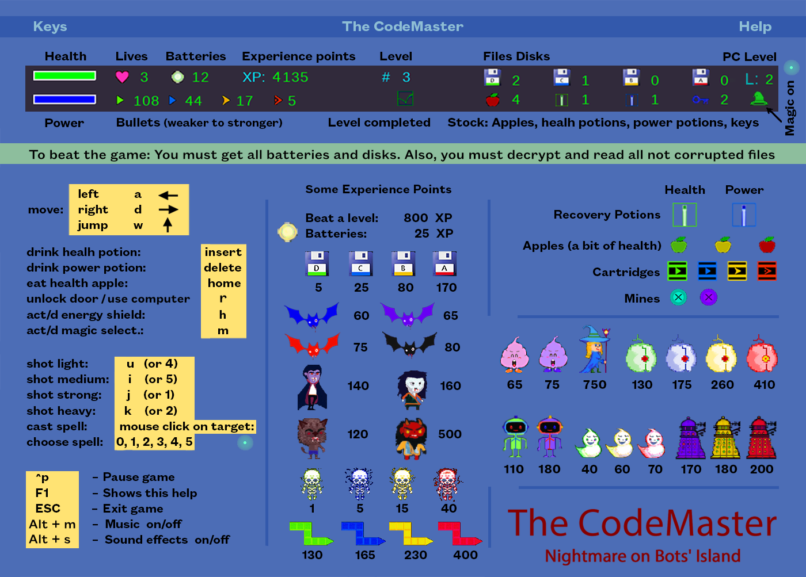

## The CodeMaster. Nightmare on Bots' Island

	The CodeMaster is a spin-off sci-fi mystery based on the 
	1988 RPG platformer game Pac's Revenge.

	program: The CodeMaster. Nightmare on Bots' Island.
	version: 0.0.7
	author: Joan A. Pinol
	author_nickname: japinol
	author_gitHub: japinol7
	author_twitter: @japinol
	description: A spin-off sci-fi mystery based on Pac's Revenge 
      series games by @japinol  (c) 1987, 1988, 2015, 2021, 2024.
    Pixel art graphics (c) 1987, 1988, 2015, 2021, 2024.
	Python requires: 3.12 or greater.

## Screenshots

  
  
  

## Videos

### Video example for previous game version 0.05

## History of the series. A spin-off? What do you mean?
	> Yes, this is a spin-off of an old game from the same author, 
      myself.  ; )
	> Original Pac's Revenge (1987-88); ahead of its time story:
	    > In a world where humanity has expanded for several planets of 
          the nearby galaxies, there is an environmental menace about 
          to explode.
          This menace would have catastrophic consequences for 
          the settlements 
          in the Systems of Draco II, Hydrus I, and the very Milky Way.
          When the United Federation of Planets (UFEP) detected the worst 
          environmental probe results in several years, they were 
          not taken by surprise.
          They thought they knew who was behind all this, but they 
          could not prove it just then.
          Present time:
          Some weeks ago, all communications from the Negasus System 
          were stopped. 
          So, the UFEP cannot be sure if its government and leader is still 
          the same, that is, Tetsuo Yagami.
          Given the seriousness of this crisis, the UFEP send their best 
          scientific secret agent to find out what is going on in the 
          Negasus System, to collect evidence of transgressions of the 
          UFEP laws, and to minimize the environmental crisis 
          if possible by reducing radiation waste.
        > Pac's Revenge had two parts, that I called phases:
			> Part 1:
              Pac travels with his spaceship to the Negasus System.
              Soon he discovers that entering the Negasus System will 
              not be easy,
              because of the barriers and traps surrounding it.
              But finally, he beats the Negasus exo-defences and arrives 
              at Orus, the most industrialized planet of the Negasus System 
              where its government lies.
			> Part 2:
              Pac lands his spaceship on the outskirts of the planet.
              He takes his anti-radiation briefcase and enters what 
              clearly is a very industrialized land.
              The platformer part of Pac's Revenge game started this way.
              Pac with his special briefcase starts to collect all the 
              radioactive batteries that he can find while bypassing 
              the security defenses and traps.
              In the platformer part of the original game, our protagonist 
              did not have any weapon, he just could dodge the industrial 
              machines and robots that he encounters.
              A lot of industrial robots make this difficult, but finally, 
              Pac arrives at the government offices.
              There, he discovers that the country's government has been 
              transformed into a dictatorship at the hands of a tyrant 
              who calls himself Great Emperor Tetsuo.
              Tetsuo's motivation seems to be acquiring power and money 
              to attract cute young women.
              The fact that G.E. Tetsuo receives him sitting on a throne 
              that is actually a toilet makes Pac suspect that he has 
              to deal with a madman.
              Someway, Pac must come back to de UFEP headquarters 
              with the batteries he has recovered, and prove what 
              is happening in the Negasus Imperial Planet.
              Finally, Pac beats Tetsuo escaping from Negasus and 
              completing his mission.
        > What made Pac's Revenge an interesting game was dealing 
          with philosophical and political issues in a futuristic world: 
          environmental contamination, techno-ultra-liberal government 
          despotism, and sexual exploitation. 
          Well, in fact, there was no other character in the game, 
          so it had no woman on it.
    > The CodeMaster. Nightmare on Bots' Island ...
        > Takes place some years later. 
        > Pac is considered a hero at the headquarters of the UFEP.
        > Pac now has a girlfriend, Kaede, to whom he wants to propose 
          (he met her in Pac's Revenge 2).
        > For this reason he travels to the planet where Kaede's father, 
          Kaito, has his kingdom, but something there is wrong.
        > Questions you will not get an answer from this demo:
            > Will Pac get Kaede's hand from her father?
            > What is really happening in Kaito's kingdom? 
            > Who is the CodeMaster and what does he have 
              to do with all this?

## Rules and user guide

	> Demo version:
	    > This is an early demo version of the game.
           In fact, currently, this is the only version.
	    > This demo does not have a story to accompany the action of 
           the game.
	> We live in an open world:
        > 'The Codemaster' is an open-world RPG platformer game. 
          You can move around all levels whenever it makes sense to 
           the story.
	> To beat the game:
	    > In this demo, you just have to get all the batteries 
          and files disks from all the levels.
	> Levels: 
	    > In this demo, levels are completed by getting all the batteries 
          and files disks.
	    > What happens in a level, stays in that level.
	      > This means that when you leave a level, all effects and NPCs  
	        in that level get paused; to be reactivated as soon 
	        as the player enters that level again.
	      > This is not a bug, it's a feature. 
	        Yeah, really. It is a design decision.
	    > Number of levels implemented for this demo: 28.
	> Doors: 
	    > Use them to go to other levels.
        > To unlock a locked door you need to use the right door key.
	> Colors: 
	    > Some objects and NPCs in the game represent their difficulty, 
          utility, power, or effectiveness by using colors.
          These are such colors ordered from lower to higher:
            > Green:  Low level items or NPCs.
            > Blue:  Medium level items or NPCs.
            > Yellow:  Better than medium level items or NPCs.
            > Red:  High level items or NPCs.
	> Player movement: 
	    > You just can move left, right or jump.
	> Player level up: 
	    > You can level up by gaining experience points.
	    > When you level up you improve your skills:
            > Currently, you just get skills when you level up to level 2.
              This is what you get:
                > Energy Shield A
                > Vortex of Doom B spell, in slot 1.
                > Vortex of Doom A spell, in slot 2.
                > Lightning Bolt A spell, in slot 3.
                > Doom Bolt B spell, in slot 4.
                > Doom Bolt A spell, in slot 5.
            > In the future, your stats will be level-up-friendly 
              and we will add more skills.
	> Player actions:
	    > Eat an apple from your stock.
	    > Drink a health potion from your stock.
	    > Drink a power potion from your stock.
	    > Get items automatically just by colliding with them.
        > Enter in unlocked doors just by approaching them.
        > Use the right keys on locked doors to unlock them.
        > Activate/deactivate an energy shield. 
          Only if the player has reach a certain level.
        > Activate/deactivate magic NPC selector (pressing m).
        > Choose current magic attack  (pressing 1, 2, 3, 4, 5, etc)
            > Choose 0 to have no spell ready.
        > Cast spells that target an NPC:
            > Vortex of Doom. 
            > Lighning Bolts.
            > Doom Bolts.
        > Kill its current life by pressing the <b> key for a time.
	> Player's ways of dying:
	    > A player dies if all his lives are killed.
	    > A life is killed:
            > When its health is lower than 0.
            > When the player falls into a hole reaching the lower 
              screen boundary.
            > When the player is stuck in some trap and press the <b> key 
              for a time.
	> Information in the score line:
	    > First line:
            > ====:  Health bar.
            > Heart:  Remaining lives.
            > Batteries: # of Batteries you have recovered.
            > XP: 	  Experience points. They also represent your score.
            > #: Current level.
            > Files Disks D, C, B, A: # files disks of each type that you 
              have recovered.
            > L: Player level  (level up by collecting XP).
	    > Second line:
            > ====:  Power bar.
            > Remaining bullets for each of the four weapons.
            > Under #: A check symbol appears if you have beaten 
              the current level.
            > Apples: Stock of apples in your inventory.
            > Health potions: Stock of health potions in your inventory.
            > Power potions: Stock of power potions in your inventory.
            > Door keys: Stock of door keys in your inventory.
            > A green hat indicates that the magic mode is on.
              You can select a target when you level up to level 2.
	> Batteries: 
	    > They represent radioactive waste due to cheap nuclear 
          industrialization an weaponry.
          Radioactive batteries are the main thing that connects this game 
          to the original Pac's Revenge game.
	> Potions: 
	    > Recovery potion: health.
	    > Recovery potion: power.
	> Cartridges: 
	    > They contain bullets. There is one cartridge type for each 
          kind of bullet.
	> Magic: 
        > To be able to use it, you need a skill that will be activated
          when you level up to level 2.
	    > You can activate a magic selector to use magic on an NPC.
	    > Magic spells:
	        1. Vortex of Doom B: A Vortex of Doom that targets the 
               selected NPC.
	        2. Vortex of Doom A: A more powerful Vortex of Doom spell.
	        3. Lightning Bolt A: A lightning bolt that targets 
               the selected NPC.
	        4. Doom Bolt B: A doom bolt that targets the selected NPC.
	        5. Doom Bolt A: A more powerful Doom Bolt spell.
	    > There are limits of spells casted than depend 
          on the type of spell:
	        > You can have only N active spells of one kind on a target.
	        > You can have only N active spells of one base kind on a level.
	> Apples: 
	    > Eat them to recover a bit of health.
          There are three types of apples:
	        > Green apples: 
              They are less than normal quality apples but still tasty.
	        > Yellow apples: 
              They are normal quality apples.
	        > Red apples: 
              They are high-quality apples.
	> Weapons and bullets:
        > There are four kinds of weapons that you can use.
          Each one of these weapons has a different range, power, 
          and power use:
            > A light weapon: Laser 1. 
                > Great range but very low power.
                > It consumes just a bit of your power attribute.
                > Very easy to find.
            > A medium weapon: Laser 2.
                > Good range but low power.
                > It consumes a little of your power attribute.
                > Easy to find.
            > A strong weapon: Photonic.
                > Low range but good power. 
                > It consumes a good deal of your power attribute.
                > Difficult to find.
            > A heavy weapon: Neutronic.
                > Pretty good range and very high power. 
                > It consumes a lot of your power attribute.
                > Very difficult to find.
	> Energy shields:
        > Right now there is only one kind of them.
            > A neutronic energy shield of type A:
            > To be able to use it, you need a skill that will be 
              activated when you level up to level 2.
            > It blocks all the bullets headed in its direction.
            > Snakes change their direction when they hit one.
            > It consumes a little bit of your power while it is on.
            > When destroyed, it costs you some power. 
              Then, it is created again.
            > Its color changes from light blue to yellow and dark pink 
              depending on its health stat.
	> Files disks: 
	    > There are four types of files disks:
	        > Type D: They contain low interesting data.
	        > Type C: They contain medium interesting data.
	        > Type B: They contain good interesting data.
	        > Type A: They contain high interesting data.
        > In later versions of the game:
            > You will use them on the computers.
	> Computers: 
	    > Right now, they are just decoration.
          In later versions, they will have an important role in 
          beating the game.
	> Mines: 
	    > There are two types of mines:
	        > Aqua mines: They deal a good deal of damage.
	        > Lilac mines: They deal great damage
	> Clocks: 
	    > Currently, clock timers do not have a real effect in the game.
          In the future, they will trigger some cool stuff.
	> NPCs droping items: 
	    > Items dropped by an NPC may appear in a position where 
          the player cannot reach.
          This can especially happen with snakes and dragons.
	      > This is not a bug, it's a feature. 
	        Yeah, really. It is a design decision. ; p
 

#### Starting with version 0.0.7, you can continue the last game
	We added a persistence feature, which automatically saves the game 
	state when the user exits the game and allows the user to continue 
	the previous game instead of starting a new one.
	Note that you cannot continue a game that ended in a Game Over 
	or that you beated winning the game.
 

## Keyboard keys

    F1:    Show a help screen while playing the game
    left,     a:    move to the left
    right,    d:    move to the right
    up,       w:    jump
    u         4:    fire a light shot
    i         5:    fire a medium shot
    j         1:    fire a strong shot
    k         2:    fire a heavy shot
    t:              try unlocking door using each key in your inventory
    h:              Switch energy shield (if you have level up enough)
    m:              switch magic and magic NPC selector (via mouse clicks)
    1-5:            choose between numbered magic attack spells. 
                    You have to acquire them
                    ex:  Vortex of Doom A, Lightning bolt A...
    0:              no current spell selected
    L_mouse_button:    cast current spell  
                       (if magic is on and the PC has enough level)
    insert:        drink a health potion
    delete:        drink a power potion
    home:          eat a health apple
    b:             hold b for a time to kill your current life
    p:           pause
    ESC:         exit game
    ^m:          pause/resume music
    ^s:          sound effects on/off
    Alt + Enter: change full screen / windowed screen mode
    L_Ctrl + R_Alt + g: grid on/off
    ^h:          shows this help to the console

    > Additional keys for debug mode:
    ^ L_Alt + numpad_divide:  toggle logger to debug/info, print info 
                     for hits...
    ^ n:             print a list of all NPCs in the current level
    ^ + Shift + n:   print a list of all NPCs in all levels, 
                     ordered by level
    ^ + Alt + Shift + n:
                     print a list of all NPCs in all levels, 
                     ordered by NPC name
    Alt + n:         print a list of all items in the current level 
    Alt + Shift + n: print a list of all items in all levels, 
                     ordered by level
    ^ + Alt + n:     print a list of all items in all levels, 
                     ordered by item name
    ^d:    print debug information to the console
    ^l:    write debug information to a log file
    L_mouse_button:  If debug mode activated, show actors in the position  
    ^L_mouse_button: If debug mode activated, select NPC to copy  
    Alt + L_mouse_button: If debug mode activated, select item to copy  
    Shift + L_mouse_button: If debug mode activated, paste selected actor.  
                     Note that you can paste actors only 
                     within the same game level.

    > Additional keys for cheating mode:
    ^i:                teletransportation: put the player above it\'s
                       current position  (cheat)
    ^ numpad_minus:    great advantage superhero (cheat)
    ^ numpad_multiply: out of phase superhero invulnerability flag (cheat)
 

## Usage

    codemaster [-h] [-f] [-l] [-m] [-n] [-p] [-u] [-d] [-t]
	
    optional arguments:
     -h, --help, 	show this help message and exit
     -f, 	--fullscreen
            Full screen display activated when starting the game
     -l, 	--multiplelogfiles
            A log file by app execution, instead of one unique log file
     -m, 	--stdoutlog
            Print logs to the console along with writing them to the 
            log file
     -n, 	--nologdatetime
            Logs will not print a datetime.
     -p, 	--nopersistdata
            Deactivate feature: Persist and recover game data, which 
            automatically save the game state when the user exits the game.
     -u, 	--nodisplayscaled
            Deactivate the scaling of the game screen. 
            Resolution depends on desktop size and scale graphics. 
            Note that Pygame scaled is considered an experimental API 
            and is subject to change.
            In most systems, it is better to have the scaling activated 
            when using the full screen display mode. 
     -d, 	--debug
            debug actions, information and traces
            This does not set the log level to debug. 
            Use the key shortcut ^ L_Alt + numpad_divide 
            to toggle log levels.
     -t, 	--debugtraces
            show debug back traces information when something goes wrong

**Default optional arguments**

	fullscreen          False
	multiplelogfiles    False
	stdoutlog           False
	nologdatetime       False
	nodisplayscaled     False
	nopersistdata       False
	debug               False
	debugtraces         False

**Test suite**

	To run the test suite:
	  $ python -m suiteoftests

	You can run the test suite executing only some tests. Examples:
	    * Execute only one test:
	        $ python -m suiteoftests -n test_bat_hit_with_enough_bullets_must_die
	    * Execute only two tests (example using bash):
	        $ python -m suiteoftests -n 'test_bat_hit_with_lightning_bolt_must_die, test_pc_enters_door_to_another_level'

	To run the test suite in full screen mode:
	  $ python -m suiteoftests -f

	To run the test suite with log debug messages:
	  $ python -m suiteoftests -d

    Notes: 
	  * Press ESC if you want to abort the current test.
	  * Press Ctrl + Alt + a if you want to abort all the remaining tests.
	  * The test suite will return a success code if all 
        non-skipped tests succeeded and were not aborted.
	  * If you tell the test suite to run some specific tests,  
        the test suite will run them even if you have decorated,
        these tests to be skipped.

**Examples of usage**

	Run the game:
	  $ python -m codemaster

	Run the game deactivating the persistence feature:
	  $ python -m codemaster -p

	Run the game starting in full screen mode:
	  $ python -m codemaster -f

**To make The CodeMaster work**

	Do this:
	  1. Clone this repository in your local system.
	  2. Go to its folder in your system.
	  3. $ pip install -r requirements.txt
	  4. $ python -m codemaster
